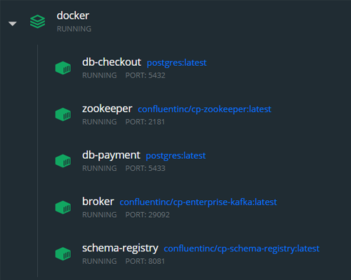

# Digital Innovation One

## Criando uma solução de e-commerce com microsserviços em Java

Neste projeto foi desenvolvida uma solução de e-commerce com a arquitetura de microsserviços, com a integração orientada a eventos utilizando o *Apache Kafka* e o *Schema Registry* para garantir a compatibilidade na comunicação.


---

### 📑 Requisitos

- [Docker](https://www.docker.com/)
- [Java JDK 14](https://www.oracle.com/br/java/technologies/javase/jdk14-archive-downloads.html)

---

### 📝 Instruções

1. Prepare a infraestrutura:

    > Crie e inicie os containers docker configurados no arquivo `docker/docker-compose.yml` seguinte comando:

    ```shell
    docker-compose up --build -d
    ```

    

    > Parar e remover todos os containers e recursos relacionados no arquivo de configuração:

    ```shell
    docker-compose down
    ```

2. Inicie a `CheckoutApplication` dentro do projeto `ecommerce-checkout-api`.

3. Inicie a `PaymentApplication` dentro do projeto `ecommerce-payment-api`.

4. Inicie um servidor web para a página contida em `ecommerce-frontend-web`.

---

### 📚 Referências

- [Apache Kafka](https://kafka.apache.org/)
- [Apache ZooKeeper](https://zookeeper.apache.org/)
- [Schema Registry](https://docs.confluent.io/1.0/schema-registry/docs/intro.html)